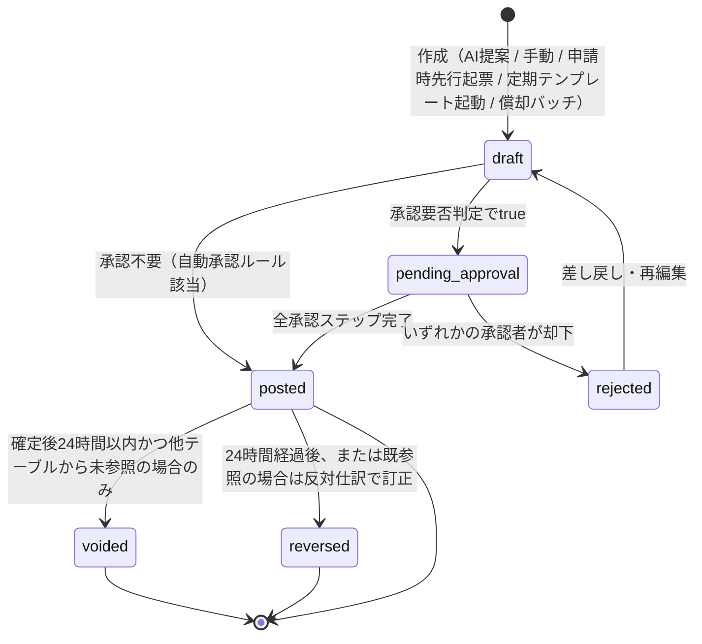
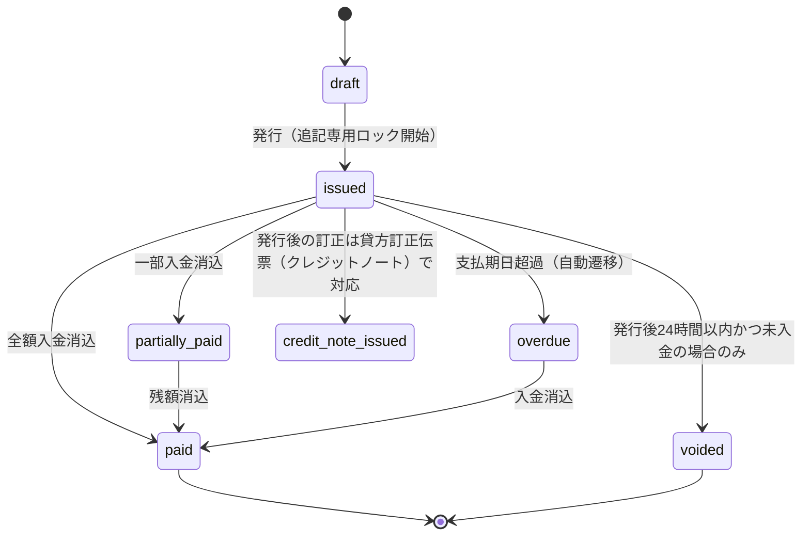
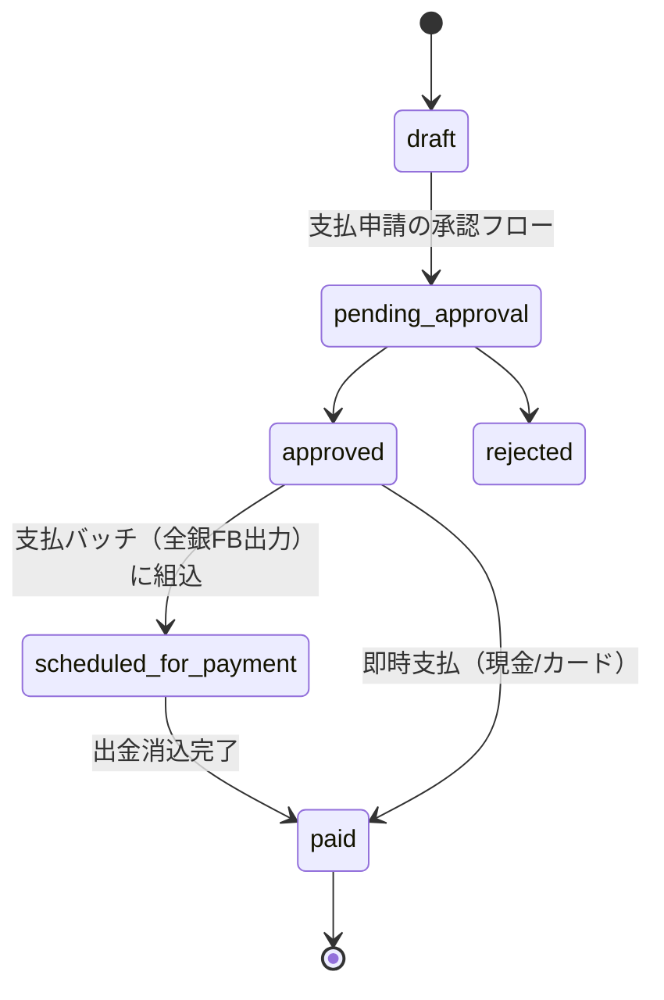
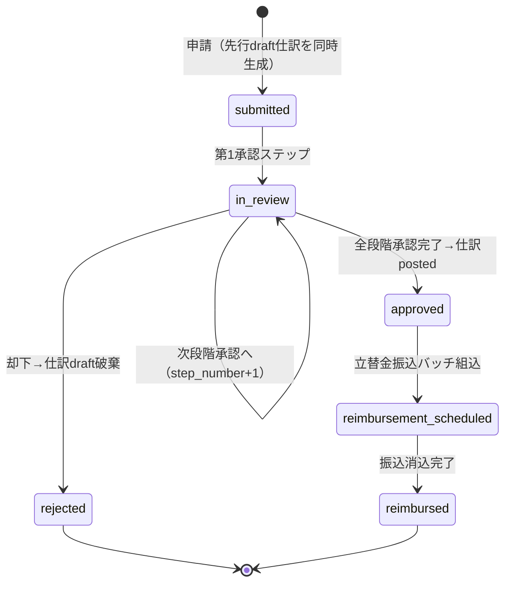
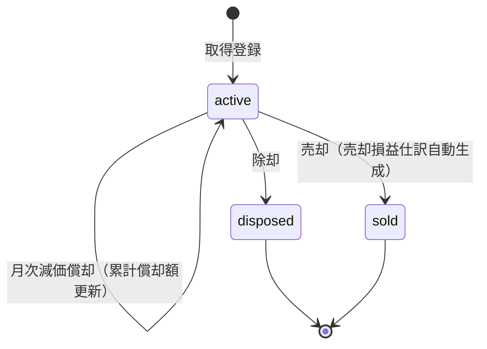

# 経理・会計オールインワンAIアプリケーション 要件定義書

- 文書番号: DOC-01
- バージョン: 1.0.0
- 対象読者: プロダクトオーナー、開発チーム、DB設計者、監査担当者
- 関連文書: `02_architecture.md`, `03_database_design.md`, `sql/001_initial_schema_all_in_one.sql`

---

## 0. 本書の位置づけと設計思想

本プロダクトは、中小企業〜中堅企業（従業員数十名〜数百名規模、複数拠点・複数子会社を将来的に想定）向けに、**経理・会計業務をこのアプリケーション1つで完結させる（All-in-One）** ことを目的とするAI活用型SaaSである。マネーフォワードクラウド、freee会計、楽楽精算、勘定奉行クラウド等の競合が個別に提供している機能群（経費精算、請求書発行、支払管理、固定資産、給与連携、税務申告支援）を、後付けの連携ではなく**単一の統合データモデル上で最初から結合**して提供する。

設計思想として以下の4原則を全機能要件に対して厳格に適用する。

1. **AIの役割分離**: AIは証憑読み取り・仕訳科目候補提示・異常検知等の「提案」にのみ関与し、仕訳の確定登録・税額計算・残高更新といった「確定処理」は決定的（deterministic）なアプリケーションロジックおよびDB制約が行う。AIの提案は必ず人間承認またはルールエンジンの検証を経由する。
2. **DB制約による最終防御**: 貸借不一致、テナント越境アクセス、確定済みデータの改ざんは、アプリケーションコードのバグや運用ミスがあってもDBレベル（CHECK制約・トリガー・RLS）で物理的に阻止される。
3. **完全テナント分離**: すべてのテナント固有テーブルは行レベルセキュリティ（RLS）でアクセス制御され、セッション変数 `app.current_tenant_id` が設定されていない・一致しない場合は一切の行が見えない。
4. **生SQL駆動**: ORMを採用せず、`pg`（node-postgres）を用いた生SQLでRLSコンテキスト設定（`SET LOCAL app.current_tenant_id`）とトランザクション制御（`FOR UPDATE`による行ロック等）を明示的に行う。

---

## 1. スコープ全体像（5領域）

| # | 領域 | 概要 | 主要競合機能との対応 |
|---|------|------|----------------------|
| A | 入出金・決済・資金管理 | 全銀協FBデータ出力（総合振込）、銀行/カード明細CSV取込、自動仕訳ルールエンジン、売掛金・買掛金入金自動消込 | MFクラウド銀行連携、freee自動で経理 |
| B | フロントオフィス・経費精算 | 交通費精算、出張旅費・日当自動計算、代理申請/承認、定期仕訳テンプレート（固定費自動起票） | 楽楽精算、MFクラウド経費 |
| C | 年次決算・資産管理・税務 | 固定資産台帳・減価償却（定額/定率）、経過勘定の自動振替・期間按分、消費税申告サポート（本則/簡易/2割特例） | 勘定奉行、freee申告 |
| D | 人事労務・給与連携 | 給与ソフトCSVからの複合給料仕訳（役員報酬/給与/預り金/社保）自動生成 | MFクラウド給与連携、freee人事労務 |
| E | ガバナンス・外部監査対応 | 電子帳簿保存法対応、監査ログ不変性保証、税理士・監査人向け専用ロール（`viewer_external`） | freee電帳法対応、勘定奉行監査証跡 |

> **重要注記（請求書の分離）**: 「請求書（顧客への売上請求: Accounts Receivable）」と「仕入請求書/買掛金（仕入先への支払: Accounts Payable）」は業務上・データ構造上明確に別概念である。売上請求書は `invoices` テーブル系列、仕入請求書・買掛金・支払管理は `vendor_bills` テーブル系列として分離する。両者を同一テーブルに同居させる設計（多くの類似プロダクトが初期に犯す誤り）は採用しない。

---

## 2. 全機能要件マトリクス

凡例: ◎=中核機能（MVP必須） / ○=標準機能 / △=将来拡張余地ありだが初期スキーマに予約

### 2.1 領域A: 入出金・決済・資金管理

| ID | 機能 | 優先度 | 概要 |
|----|------|--------|------|
| A-01 | 銀行口座マスタ管理 | ◎ | 複数金融機関・複数口座（普通/当座）の登録、残高管理 |
| A-02 | 銀行明細CSV/API取込 | ◎ | 銀行別フォーマットのCSVを正規化して取込、重複検知（ハッシュ照合） |
| A-03 | クレジットカード明細取込 | ◎ | カード会社別CSV取込、法人カード利用者への自動紐付け |
| A-04 | 自動仕訳ルールエンジン | ◎ | 摘要文字列パターン・金額・取引先マッチによる仕訳候補自動生成（決定的ルール、AIは補助提案のみ） |
| A-05 | 売掛金入金自動消込 | ◎ | 入金明細と `invoices` の金額・振込人名一致による自動消込、一部入金・過入金対応 |
| A-06 | 買掛金支払自動消込 | ◎ | 出金明細と `vendor_bills` の消込 |
| A-07 | 全銀協FBデータ出力（総合振込） | ◎ | 全銀協規定フォーマット（固定長）での総合振込データ生成、支払承認済みの `vendor_bills`/経費精算/給与振込に対応 |
| A-08 | 資金繰り予測 | ○ | 確定済み債権債務からのキャッシュフロー予測 |
| A-09 | 複数通貨対応 | △ | 外貨建て取引の記帳（初期スキーマに `currency_code`/`exchange_rate` を予約） |

### 2.2 領域B: フロントオフィス・経費精算

| ID | 機能 | 優先度 | 概要 |
|----|------|--------|------|
| B-01 | 交通費精算（IC明細/手入力） | ◎ | 交通系ICカード履歴取込、経路・金額の登録 |
| B-02 | 出張旅費・日当自動計算 | ◎ | 出張規程マスタに基づく日当・宿泊費の自動算出 |
| B-03 | 経費申請・代理申請 | ◎ | 本人申請および秘書等による代理申請（`submitted_by` と `on_behalf_of` を分離） |
| B-04 | 多段階承認ワークフロー | ◎ | `approval_rules` に `step_number` を持たせた複数段階承認 |
| B-05 | 申請時先行仕訳起票 | ◎ | 申請と同時に `draft` 仕訳を生成し、既存の仕訳承認ロジックへ合流 |
| B-06 | 立替金精算・払戻 | ◎ | 従業員立替金の未払金計上、振込データ生成、消込までの一気通貫フロー |
| B-07 | 法人カード明細の経費紐付け | ◎ | カード明細と個別経費申請の突合 |
| B-08 | 定期仕訳テンプレート（固定費自動起票） | ◎ | 家賃・リース料等の毎月定型仕訳を自動生成（`draft`起票→承認） |
| B-09 | 経費規程チェック（上限額アラート） | ○ | 費目別上限超過時の警告・承認必須化 |

### 2.3 領域C: 年次決算・資産管理・税務

| ID | 機能 | 優先度 | 概要 |
|----|------|--------|------|
| C-01 | 固定資産台帳 | ◎ | 資産種別、取得価額、耐用年数、償却方法の一元管理 |
| C-02 | 減価償却計算（定額法/定率法） | ◎ | 月次バッチによる自動償却仕訳生成、期中取得の月数按分 |
| C-03 | 固定資産の除却・売却 | ○ | 除却損・売却損益の自動仕訳 |
| C-04 | 経過勘定の自動振替（前払/未払/前受/未収） | ◎ | 期間按分ルールに基づく自動振替仕訳 |
| C-05 | 消費税区分管理 | ◎ | 課税/非課税/不課税/免税、軽減税率(8%)/標準税率(10%)の取引区分 |
| C-06 | 消費税申告サポート（本則課税） | ◎ | 課税売上・課税仕入の集計、仕入税額控除計算 |
| C-07 | 消費税申告サポート（簡易課税） | ◎ | みなし仕入率によるみなし仕入税額計算 |
| C-08 | 消費税申告サポート（2割特例） | ◎ | インボイス登録に伴う小規模事業者向け2割特例の税額計算 |
| C-09 | 決算整理仕訳サポート | ○ | 棚卸資産評価、貸倒引当金計上等のテンプレート |
| C-10 | 財務諸表出力（PL/BS/CF） | ◎ | 会計期間別の試算表・財務三表生成 |

### 2.4 領域D: 人事労務・給与連携

| ID | 機能 | 優先度 | 概要 |
|----|------|--------|------|
| D-01 | 給与CSV取込（主要給与ソフト対応） | ◎ | 汎用CSVマッピング機能により各社給与ソフト出力に対応 |
| D-02 | 複合給料仕訳自動生成 | ◎ | 役員報酬/給与手当/預り金（源泉所得税・住民税・社会保険料）/法定福利費への複合仕訳を1トランザクションで生成 |
| D-03 | 給与振込データ生成 | ◎ | 全銀協FBフォーマットでの給与振込データ出力（A-07と連携） |
| D-04 | 社会保険料の会社負担/本人負担分離 | ◎ | 法定福利費（会社負担）と預り金（本人負担）を分離計上 |
| D-05 | 賞与仕訳対応 | ○ | 賞与時の別テンプレート |

### 2.5 領域E: ガバナンス・外部監査対応

| ID | 機能 | 優先度 | 概要 |
|----|------|--------|------|
| E-01 | 電子帳簿保存法対応（証憑保存） | ◎ | スキャナ保存要件（タイムスタンプ、検索要件：取引年月日・金額・取引先）を満たす添付ファイル管理 |
| E-02 | 監査ログ不変性保証 | ◎ | 全ての確定操作を追記専用ログに記録、UPDATE/DELETE物理禁止 |
| E-03 | 外部監査人・税理士ロール | ◎ | `viewer_external` ロールによる読み取り専用・期間限定アクセス |
| E-04 | 内部統制（職務分掌） | ◎ | 申請者と承認者の分離強制（自己承認禁止） |
| E-05 | アクセスログ | ○ | ログイン・重要操作の記録 |
| E-06 | データエクスポート（税理士連携） | ○ | 仕訳データの標準フォーマット（弥生形式等）エクスポート |

---

## 3. ユースケース詳細（代表例）

### UC-B-01: 従業員が交通費精算を申請し、承認後に立替金が精算されるまで

1. 従業員が経費精算アプリ画面から交通費（駅すぱあと連携または手入力）を入力し申請する。
2. システムは申請と同時に、支払方法「従業員立替」に対応する貸方科目（未払金）で `draft` 状態の仕訳を先行生成する（設計パターン: 申請時先行仕訳起票）。
3. `approval_rules` に定義された経費精算の承認フロー（例: 上長 → 経理）に従い、`approval_requests` に段階的な承認レコードが作成される。
4. 各承認者が承認すると `approval_history` に `step_number` 付きで履歴が残る。全段階の承認が完了すると仕訳は `pending_posting` へ遷移する。
5. 経理担当者が最終確認し、仕訳が `posted`（確定）される。この時点で貸借の一致・追記専用制約がDBトリガーにより最終検証される。
6. 経理担当者が対象期間の立替金振込対象を集計し、全銀協FBデータを出力する（A-07と連携）。
7. 銀行から出金明細を取込むと、自動消込ロジックにより当該未払金が消込まれ、精算が完了する。

### UC-A-05: 売掛金の入金自動消込（部分入金を含む）

1. 顧客への `invoices`（売上請求書）が発行済み（`issued`）状態で存在する。
2. 銀行明細CSVを取込むと、入金額・振込人名（カナ）から `invoices` との自動マッチングを試行する。
3. 完全一致（金額・取引先一致）の場合は自動で `invoice_payments` を生成し、請求書ステータスを `paid` に更新、消込仕訳を自動起票する。
4. 一部入金の場合は `invoices` を `partially_paid` とし、残額を保持する。過入金の場合は前受金として計上し経理確認フラグを立てる。
5. マッチング不能な入金は「未消込」キューに入り、経理担当者が手動で消込先を指定する。

### UC-C-02: 月次減価償却バッチ

1. 月次決算バッチが起動し、`fixed_assets` のうち稼働中（除却・売却されていない）資産を対象に、`depreciation_method`（定額法/定率法）と `useful_life_years` に基づき当月償却額を計算する。
2. 期中取得資産は取得月からの月数按分を行う。
3. 計算結果は `depreciation_schedules` に記録され、`draft` の減価償却仕訳が自動生成される。
4. 経理担当者が内容を確認し承認・確定（`posted`）する。

### UC-D-02: 給与CSV取込から複合仕訳生成

1. 給与ソフトからエクスポートしたCSVをアップロードし、列マッピングテンプレート（`payroll_import_mappings`）で科目対応を定義する。
2. システムは1回の給与支払について、役員報酬・給与手当（借方）、源泉所得税預り金・住民税預り金・社会保険料預り金（貸方）、現金預金（貸方: 差引支給額）を1トランザクション内の複合仕訳として生成する。
3. 会社負担分の社会保険料（法定福利費）は別建てで借方計上される。
4. `draft` として生成後、経理担当者が確認し確定する。

### UC-E-03: 税理士による外部閲覧

1. テナント管理者が税理士アカウントを `viewer_external` ロールで招待し、アクセス可能期間（開始日・終了日）を指定する。
2. 税理士はログイン後、RLSにより自テナントのデータのみ、かつ読み取り専用で閲覧できる。
3. アクセス可能期間を過ぎると、DBレベルのRLSポリシー条件により自動的にアクセス不能となる。
4. 税理士による全アクセスは監査ログに記録される。

---

## 4. 状態遷移図

### 4.1 仕訳（journal_entries）のライフサイクル

### 4.2 売上請求書（invoices）のライフサイクル

### 4.3 仕入請求書/買掛金（vendor_bills）のライフサイクル

### 4.4 経費精算申請（expense_reports）のライフサイクル

### 4.5 固定資産（fixed_assets）のライフサイクル

---

## 5. 権限モデル（RBAC / RLS方針）

### 5.1 ロール定義

| ロールコード | 名称 | 権限概要 |
|--------------|------|----------|
| `owner` | テナント管理者 | 全機能・全設定・ユーザー管理の最上位権限 |
| `accounting_manager` | 経理責任者 | 仕訳確定・決算処理・税務申告設定・承認ルール設定 |
| `accountant` | 経理担当者 | 仕訳起票・消込・請求書発行・支払処理（確定権限は範囲内） |
| `approver` | 承認者（部門長等） | 自部門の経費・購買申請の承認 |
| `employee` | 一般従業員 | 自身の経費精算申請・自身の証憑閲覧のみ |
| `payroll_admin` | 給与担当 | 給与CSV取込・給与仕訳生成の実行権限 |
| `viewer_external` | 外部閲覧者（税理士・監査人） | 読み取り専用、アクセス期間制限あり、エクスポート可否は個別設定 |
| `system_service` | システム内部処理用 | バッチ処理（償却計算、自動消込等）専用のサービスアカウント |

### 5.2 RBAC × RLS の役割分担

- **RBAC（アプリケーション層）**: 「どの画面・APIエンドポイントを呼べるか」「どの操作ボタンが見えるか」を制御する。ロールと機能権限（`permissions`）の多対多を `role_permissions` で管理する。
- **RLS（DB層）**: 「どのテナントの、どの行にアクセスできるか」を物理的に強制する最終防御線。RBACが誤ってもRLSが越境アクセスを阻止する。

### 5.3 RLS方針の骨子

1. すべてのテナント固有テーブルに `tenant_id` 列を持たせ、`ENABLE ROW LEVEL SECURITY` を設定する。
2. アプリケーションはトランザクション開始時に必ず `SET LOCAL app.current_tenant_id = '<tenant_uuid>'` を実行する。これを行わない接続は全テーブルで0件しか見えない（fail-closed設計、デフォルトdeny）。
3. 標準ポリシー: `USING (tenant_id = current_setting('app.current_tenant_id')::uuid)`。
4. `viewer_external` ロールについては、上記に加えて `app.current_user_id` から `external_access_grants` テーブルの有効期間（`valid_from` / `valid_until`）を参照し、期間外であれば行を返さない追加条件をポリシーに組み込む。
5. `system_service` ロールはバッチ処理用に複数テナットを横断する必要があるため、バッチジョブ単位で対象テナントIDを都度 `SET LOCAL` してから処理する（一括横断クエリは行わない）。
6. 追記専用テーブル（監査ログ、確定仕訳明細、発行済み請求書等）は、RLSの `SELECT`/`INSERT` ポリシーに加え、`UPDATE`/`DELETE` を許可するポリシー自体を作成しない（＝トリガーとRLS両方で二重に禁止）。

### 5.4 職務分掌（Segregation of Duties）ルール

- 申請者（`submitted_by`）と承認者（`approved_by`）は同一ユーザーであってはならない。自己承認はアプリケーション層およびDBトリガー（`approval_history` INSERT時のCHECK）の両方で禁止する。
- 給与仕訳の確定権限は `payroll_admin` 単独では持たず、`accounting_manager` の最終承認を必須とする。

---

## 6. 非機能要件

| 分類 | 要件 |
|------|------|
| 電子帳簿保存法対応 | スキャナ保存の検索要件3項目（取引年月日・取引金額・取引先）をメタデータとして必須格納。タイムスタンプ付与またはシステム上での訂正削除履歴保持のいずれかで真実性を担保する。 |
| 監査ログ不変性 | すべての確定系操作（仕訳確定、請求書発行、承認）を追記専用ログに記録。DBトリガーでUPDATE/DELETEを物理的に禁止。 |
| データ保持期間 | 会計帳簿は最低7年（欠損金繰越がある場合10年）保持できるスキーマ設計とする。 |
| 可用性 | 月次・年次決算期間中の高負荷に耐えるインデックス設計（`03_database_design.md`参照）。 |
| 監査証跡の追跡可能性 | 全ての確定仕訳から起票元（経費申請/請求書/給与インポート/償却バッチ等）への `source_type`/`source_id` によるトレーサビリティを保証する。 |
| 多通貨拡張性 | 初期スコープは日本円のみだが、`currency_code`/`exchange_rate` 列を最初から予約し将来の破壊的変更を回避する。 |

---

## 7. 用語集（抜粋）

| 用語 | 定義 |
|------|------|
| 全銀協FBデータ | 全国銀行協会が定めるファームバンキング標準フォーマット（固定長テキスト、総合振込等） |
| 消込（けしこみ） | 入金・出金明細と債権・債務を突合し、決済済みとして確定する処理 |
| 経過勘定 | 前払費用・未払費用・前受収益・未収収益等、期間帰属を調整する勘定科目 |
| 2割特例 | インボイス制度導入に伴う小規模事業者向けの消費税簡易計算特例（売上税額の2割を納税額とする） |
| void | 確定直後・未参照の仕訳/請求書等を物理的に取消状態にする即時取消処理（反対仕訳とは異なる） |
