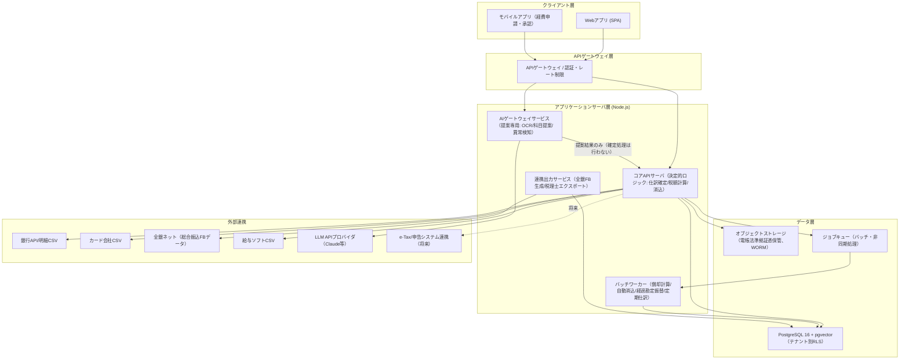
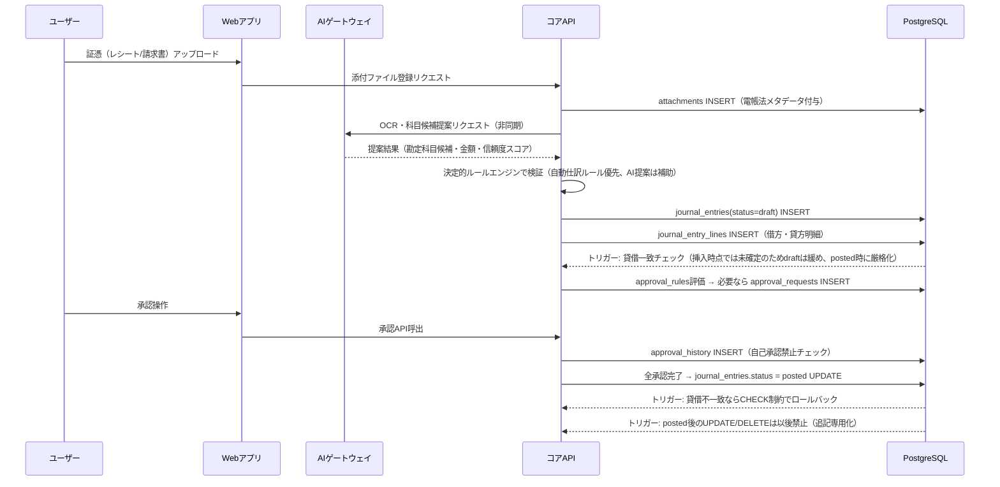
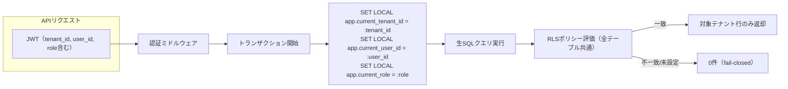

# 経理・会計オールインワンAIアプリケーション アーキテクチャ設計書

- 文書番号: DOC-02
- バージョン: 1.0.0
- 関連文書: `01_requirements.md`, `03_database_design.md`, `sql/001_initial_schema_all_in_one.sql`

---

## 1. システム構成

### 1.1 全体構成図

### 1.2 レイヤー構成と責務分離

| レイヤー | 責務 | 確定処理の可否 |
|----------|------|-----------------|
| AIゲートウェイサービス | OCRによる証憑読み取り、仕訳科目候補のスコアリング提示、異常取引の検知アラート、消込候補の推奨 | 不可（提案JSON出力のみ、DBへは`suggested_*`列またはstaging領域へ書込） |
| コアAPIサーバ | 仕訳の確定登録、承認ワークフロー制御、消費税計算、消込確定、残高更新 | 可（唯一の確定処理実行主体） |
| バッチワーカー | 月次減価償却、経過勘定自動振替、定期仕訳起票、期日超過検知 | 可（`draft`生成まで。`posted`確定は承認ルールに従う） |
| DB（PostgreSQL） | 制約・トリガーによる最終防御（貸借一致、追記専用、RLS） | 強制（アプリのバグを物理的に無効化） |

この分離により、AIモデルの出力が誤っていても会計データの正確性（貸借一致・税額計算）はコアAPIとDB制約が保証する。AIゲートウェイはコアAPIに対して常に「提案」としてのみデータを渡し、コアAPI側が決定的ルールで検証・変換した上で`draft`仕訳を生成する。

---

## 2. データフロー

### 2.1 証憑から仕訳確定までの標準フロー

### 2.2 銀行明細取込〜自動消込フロー

1. 銀行明細CSVをアップロード（またはAPI経由取得）。
2. コアAPIが明細を正規化し、`bank_transactions` にハッシュ値（取込元・日付・金額・摘要から生成）付きで挿入。重複ハッシュは自動スキップ。
3. `auto_journal_rules`（決定的ルール: 摘要パターン・金額範囲・取引先マッチ）を上から順に評価し、該当すれば `draft` 仕訳を自動生成。
4. 入金トランザクションは同時に `invoices` への自動消込マッチングを試行（金額・振込人名の一致度で判定）。
5. 出金トランザクションは `vendor_bills` / 経費立替金への自動消込マッチングを試行。
6. マッチ不能な明細は「要確認」キューへ。経理担当者が手動で仕訳・消込先を指定。

### 2.3 全銀協FBデータ出力フロー

1. 経理担当者が支払対象期間・支払方法（総合振込）を指定し、支払対象一覧（承認済み `vendor_bills` / 承認済み経費立替金 / 給与振込データ）を集計。
2. コアAPIが `payment_batches` レコードを作成し、対象明細を `payment_batch_items` に固定（この時点でスナップショット化し、以後の請求書変更の影響を受けない）。
3. `ExportService` が全銀協規定の固定長フォーマットに変換し、ファイルを生成。生成物は改変不可のオブジェクトストレージに保存し、`payment_batches.file_hash` に記録。
4. 出力後、`payment_batches.status` を `exported` に変更（以後は反対仕訳的な取消のみ可能、再出力は新バッチとして生成）。
5. 実際の銀行出金明細取込時に、`payment_batch_items` と自動照合し消込を行う。

---

## 3. 外部連携仕様

### 3.1 全銀協FBデータ（総合振込）

| 項目 | 内容 |
|------|------|
| フォーマット | 全銀協制定 固定長テキスト（ヘッダーレコード/データレコード/トレーラレコード/エンドレコード） |
| 文字コード | JIS X 0201（半角カナ）想定、振込先名義は全角→半角カナ変換処理を実装 |
| 生成トリガー | 支払承認済みの `vendor_bills`・経費精算・給与振込をバッチ集計した `payment_batches` |
| 検証 | 生成後にレコード件数・合計金額のチェックデジットを検証してから確定出力 |
| 保存 | 生成ファイルはオブジェクトストレージに保存し、`payment_batches` テーブルとハッシュで紐付け、再生成不可（改版時は新バッチ） |

### 3.2 銀行/カード明細CSV取込

| 項目 | 内容 |
|------|------|
| 対応形式 | 金融機関別CSVレイアウトを `bank_import_profiles` にマッピング定義として保持（メンテナンス性確保） |
| 重複防止 | `(bank_account_id, transaction_date, amount, description)` のハッシュで一意制約 |
| ステータス管理 | `unmatched` → `auto_matched` / `manually_matched` → `reconciled` |

### 3.3 AIゲートウェイ仕様

| 項目 | 内容 |
|------|------|
| 用途 | OCR（証憑読取）、勘定科目候補提示、異常検知（金額外れ値・重複申請検知）、消込候補推奨 |
| 入出力契約 | 入力: 証憑画像/テキスト・取引メタデータ。出力: 構造化JSON（候補科目コード配列＋信頼度スコア、根拠テキスト） |
| ガードレール | AI出力は必ず `suggested_account_code` 等の提案用列/一時テーブルに格納し、確定用の `account_code` 列には直接書き込ませない。コアAPIのバリデーション層（存在する勘定科目コードか、テナントの科目体系か等）を通過して初めて`draft`仕訳に反映される。 |
| 障害時挙動 | AIゲートウェイが不可用でも、手動科目選択によりコアAPIの機能は継続動作する（AIは非クリティカルパス） |
| モデル | Claude API（Anthropic）を利用。プロンプトにはテナント固有の勘定科目マスタ・過去の仕訳パターン（pgvectorによる類似仕訳検索結果）をコンテキストとして付与し提案精度を向上させる。 |

### 3.4 電子帳簿保存法対応ストレージ

| 項目 | 内容 |
|------|------|
| 保存要件 | スキャナ保存の3要件（真実性・可視性・検索性）を満たす。検索性は取引年月日・取引金額・取引先の3項目でのインデックス検索を保証。 |
| 真実性確保 | タイムスタンプ付与（時刻認証局連携、将来拡張）またはシステムでの訂正削除履歴の保持（本設計では追記専用DB設計により後者を採用）。 |
| ストレージ方式 | WORM（Write Once Read Many）特性を持つオブジェクトストレージ、または通常ストレージ＋DBトリガーによる論理的追記専用制御の併用。 |
| メタデータ | `attachments` テーブルに `transaction_date`, `amount`, `counterparty_name` を必須列として保持し全文検索/部分一致検索インデックスを付与。 |

### 3.5 給与ソフトCSV連携

| 項目 | 内容 |
|------|------|
| 対応方式 | 汎用CSVインポート＋列マッピングテンプレート（`payroll_import_mappings`）により主要給与ソフトの出力形式に対応 |
| 生成物 | 複合仕訳（役員報酬/給与手当/預り金各種/法定福利費）を1トランザクションで生成 |

---

## 4. テナント分離アーキテクチャ

### 4.1 RLSによる構造的分離

- JWTを検証したのち、コネクションプールから払い出した接続上でトランザクションを開始し、最初に必ず `SET LOCAL app.current_tenant_id` 等を設定する。
- `SET LOCAL` はトランザクション終了時に自動的にリセットされるため、コネクションプーリング環境でテナントIDが次のリクエストに漏れ出すことがない。
- バッチ処理（`system_service`ロール）もテナントごとにループしてジョブを実行し、横断クエリは行わない。

### 4.2 生SQL駆動の理由

ORMを不採用としたのは、以下の会計特有の要件をSQLレベルで厳密に制御する必要があるため。

1. `SET LOCAL app.current_tenant_id` のようなセッション変数制御はORMの抽象化と相性が悪く、コネクションプーリング下での漏洩リスクを避けるため生SQLで明示的にトランザクション境界を管理する。
2. 仕訳確定時の残高更新・消込処理では `SELECT ... FOR UPDATE` による明示的な行ロックが必須であり、ORMの遅延ロードやトランザクション自動管理では意図しないロック順序・デッドロックを招きやすい。
3. 複合仕訳（給与仕訳等）のような多行同時INSERTを1トランザクションで確実に行うには、生SQLのバッチINSERTの方が制御しやすい。

---

## 5. 技術スタック

| レイヤー | 技術 |
|----------|------|
| DB | PostgreSQL 16（RLS, CHECK制約, トリガー, パーティショニング）+ pgvector拡張（仕訳類似検索・AI提案精度向上） |
| DBアクセス | `pg`（node-postgres）による生SQL、マイグレーション管理は独自SQLファイル（`sql/NNN_*.sql`）を順序適用 |
| アプリケーションサーバ | Node.js（TypeScript） |
| ジョブキュー | 非同期バッチ処理用キュー（償却計算、自動消込、FBデータ生成等） |
| オブジェクトストレージ | 証憑・添付ファイル・FB出力ファイルの保管（WORM運用） |
| AI | Claude API（Anthropic）、pgvectorによる過去仕訳の類似検索でコンテキスト補強 |

---

## 6. セキュリティ・監査アーキテクチャ

1. **監査ログの不変性**: `audit_logs` テーブルへのINSERTのみ許可し、UPDATE/DELETEを行うロールを一切作成しない。加えてトリガーで物理的に禁止（RLSとトリガーの二重防御）。
2. **確定データの追記専用化**: `posted` 状態に遷移した `journal_entries` / `journal_entry_lines`、`issued` 状態の `invoices` は、UPDATE/DELETEを行おうとするとトリガーが例外を発生させる。訂正は反対仕訳または新バージョンの追加で行う。
3. **職務分掌の強制**: 承認INSERT時にトリガーで「申請者=承認者」の組み合わせを拒否する。
4. **外部監査人アクセスの時限化**: `viewer_external` のRLSポリシーにアクセス許可期間の条件を組み込み、期限切れ後はDBレベルで自動遮断する。
5. **全操作の追跡可能性**: `journal_entries.source_type` / `source_id` により、どの業務イベント（経費申請・請求書発行・給与インポート・償却バッチ等）から仕訳が生じたかを常にトレース可能にする。
