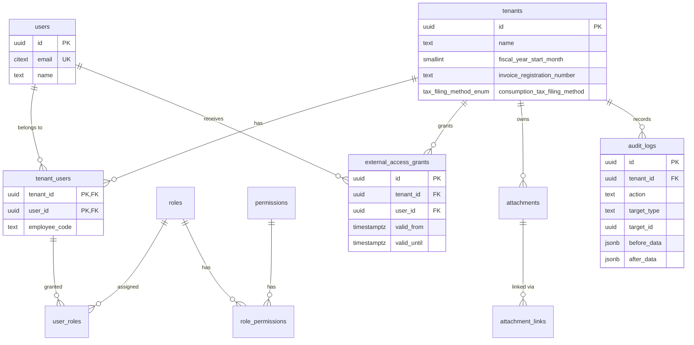
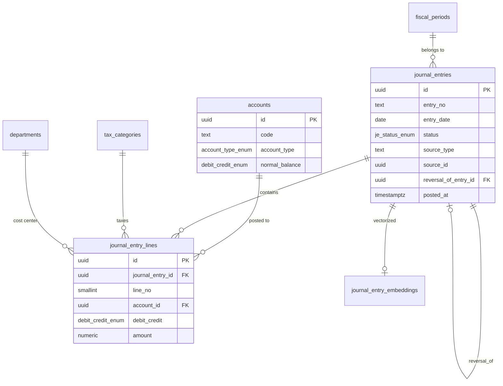
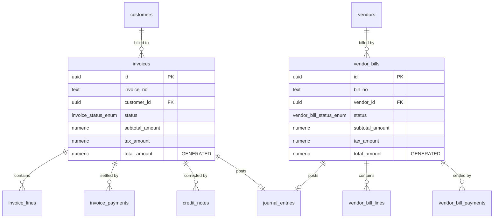
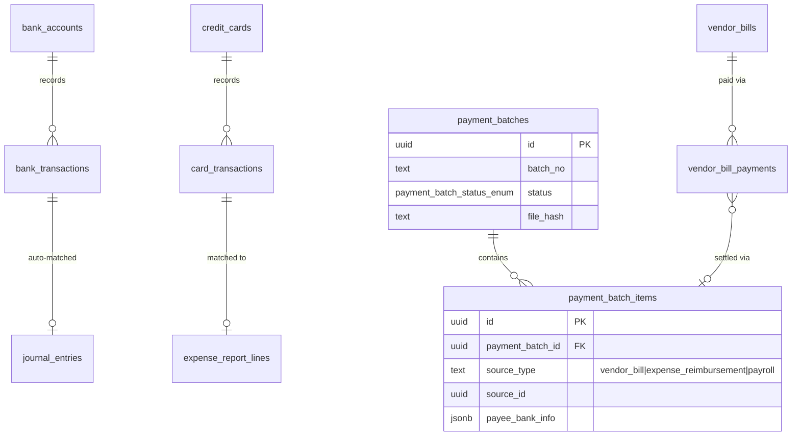
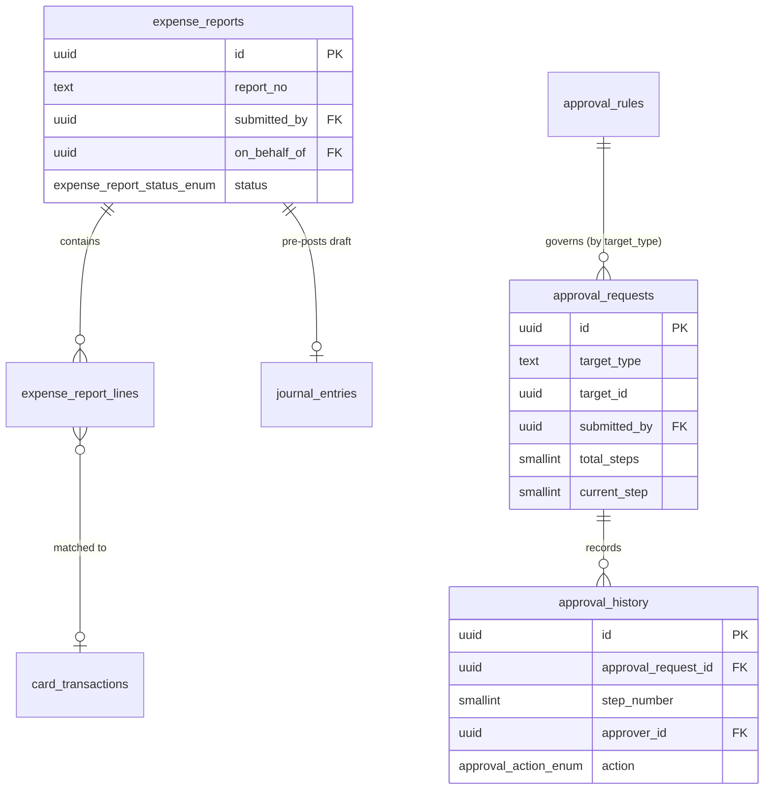
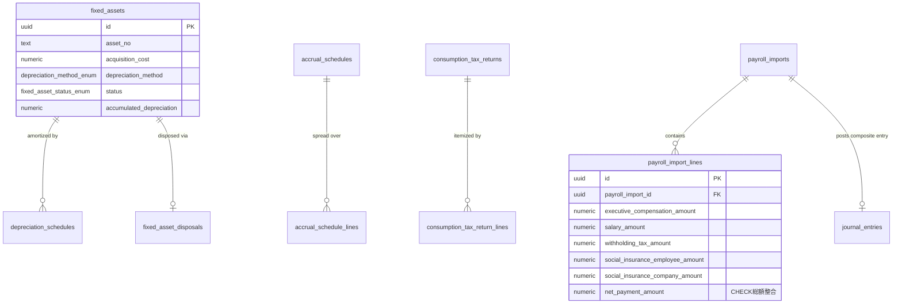

# 経理・会計オールインワンAIアプリケーション 統合データベース物理設計書

- 文書番号: DOC-03
- バージョン: 1.0.0
- 対象DBMS: PostgreSQL 16 + pgvector + pg_trgm + citext + pgcrypto
- 対応DDL: `sql/001_initial_schema_all_in_one.sql`
- 検証状況: 本設計書のDDLは、PGlite(WASM版実PostgreSQLエンジン)上で実際に適用し、
  以下の観点を自動テストで確認済み(詳細は本書末尾「検証結果サマリー」参照)。
  - RLSによるテナント越境アクセスの遮断(読み取り・書き込み双方)
  - `app.current_tenant_id` 未設定時のfail-closed動作
  - 仕訳の貸借不一致時の投稿(posted)拒否
  - 確定後の仕訳ヘッダ・明細・監査ログ等の追記専用制約
  - 24時間以内・未参照時のみのvoid許可
  - 自己承認の禁止
  - `viewer_external`(税理士等)の時限アクセス制御

---

## 1. 設計方針の要点

1. 全テーブルは `id UUID PRIMARY KEY DEFAULT gen_random_uuid()` を採用し、テナント固有テーブルには `tenant_id UUID NOT NULL` を必須列として持たせる。
2. 金額列は `NUMERIC(18,2)` を基本とし、将来の外貨対応を見据え請求書等に `currency_code` / `exchange_rate` を予約している。
3. 「売上請求書(`invoices`系)」と「仕入請求書/買掛金(`vendor_bills`系)」は物理的に完全分離されたテーブル系列である。
4. ステータス遷移が本質的なテーブル(`journal_entries`, `invoices`, `vendor_bills`, `expense_reports`, `fixed_assets`)はENUM型で状態を制約し、トリガーで遷移ルールを強制する。
5. AIが直接書き込む列は存在しない。AI提案は `ai_suggestions` テーブルへ隔離保存され、確定列(`account_id`等)への反映は必ずアプリケーション層の決定的ロジックを経由する。

---

## 2. ER図(領域別)

### 2.1 コア: テナント / RBAC / ガバナンス

### 2.2 勘定科目 / 仕訳(会計の中核)

貸借一致は `journal_entry_lines` の `CHECK(amount > 0)` に加え、`journal_entries` が `draft -> posted` へ遷移する瞬間に `fn_check_journal_balance()` トリガーが `SUM(debit) = SUM(credit)` かつ2行以上であることを検証する。不一致の場合は例外(SQLSTATE 23514)でロールバックされる。

### 2.3 売上請求書(AR)/ 仕入請求書・買掛金(AP)— 明確分離

`invoices`(売上請求書=Accounts Receivable)と `vendor_bills`(仕入請求書/買掛金=Accounts Payable)は列構成・状態遷移・関連テーブル(`invoice_lines`/`vendor_bill_lines`、`invoice_payments`/`vendor_bill_payments`)ともに完全に独立しており、共通テーブルへの同居は行っていない。

### 2.4 銀行・カード・支払バッチ(全銀協FB)

`payment_batch_items` はポリモーフィック関連(`source_type`/`source_id`)により、仕入債務・経費立替金・給与振込という異なる発生源からの支払を単一の全銀協FB出力バッチへ統合する。出力(`exported`)後はスナップショットとして追記専用トリガー的な振る舞い(`fn_guard_payment_batch`)により再変更を防止する。

### 2.5 経費精算 / 承認ワークフロー

承認は `target_type`/`target_id` によるポリモーフィック関連で `journal_entry` / `expense_report` / `vendor_bill` を横断的に扱う共通ワークフローである。`approval_requests.submitted_by` を基準に、`approval_history` へのINSERT時、`fn_prevent_self_approval()` トリガーが申請者=承認者の組み合わせを拒否する。

### 2.6 固定資産 / 経過勘定 / 消費税 / 給与

---

## 3. テーブル一覧(全57テーブル・領域対応表)

| 領域 | テーブル |
|------|----------|
| コア(共通) | tenants, users, tenant_users, roles, permissions, role_permissions, user_roles, external_access_grants |
| ガバナンス(E) | attachments, attachment_links, audit_logs, ai_suggestions |
| 勘定科目/期間(共通) | departments, account_categories, accounts, tax_categories, fiscal_years, fiscal_periods |
| 取引先(共通) | customers, vendors |
| 仕訳(共通・会計中核) | journal_entries, journal_entry_lines, journal_entry_embeddings |
| 領域A(資金管理) | bank_accounts, bank_import_profiles, credit_cards, bank_transactions, card_transactions, auto_journal_rules, payment_batches, payment_batch_items |
| 領域A(売上請求書) | invoices, invoice_lines, credit_notes, invoice_payments |
| 領域A(仕入請求書/買掛金) | vendor_bills, vendor_bill_lines, vendor_bill_payments |
| 承認ワークフロー(共通) | approval_rules, approval_requests, approval_history |
| 領域B(経費精算) | expense_categories, travel_policies, expense_reports, expense_report_lines, recurring_journal_templates, recurring_journal_runs |
| 領域C(固定資産) | fixed_assets, depreciation_schedules, fixed_asset_disposals |
| 領域C(経過勘定) | accrual_schedules, accrual_schedule_lines |
| 領域C(消費税) | consumption_tax_returns, consumption_tax_return_lines |
| 領域D(給与連携) | payroll_import_mappings, payroll_imports, payroll_import_lines |

---

## 4. 主要インデックス設計

| テーブル | インデックス | 目的 |
|----------|---------------|------|
| journal_entries | (tenant_id, entry_date) / (tenant_id, status) / (tenant_id, source_type, source_id) | 月次/年次決算の期間検索、ステータス別ワークキュー、起票元トレーサビリティ |
| journal_entry_lines | (tenant_id, account_id) / (journal_entry_id) | 科目別元帳(総勘定元帳)集計、明細取得 |
| journal_entry_embeddings | ivfflat(embedding vector_cosine_ops) | pgvectorによる過去仕訳の類似検索(AI提案精度向上) |
| invoices | (tenant_id, status) / (tenant_id, customer_id) / (tenant_id, due_date) WHERE未収 | 未収金管理、期日超過検知 |
| bank_transactions | (tenant_id, match_status) / (tenant_id, transaction_date) | 消込待ちキュー、期間別明細検索 |
| attachments | (tenant_id, transaction_date, amount, counterparty_name) / trgm(counterparty_name) | 電帳法検索要件3項目、あいまい検索 |
| customers / vendors | trgm(kana_name) | 振込人名・取引先名のあいまいマッチング(自動消込) |

---

## 5. トリガー一覧

| トリガー関数 | 適用対象 | 役割 |
|--------------|----------|------|
| `fn_set_updated_at` | `updated_at`列を持つ全テーブル | 更新時刻の自動更新 |
| `fn_guard_journal_entry_transition` | journal_entries (UPDATE/DELETE) | posted以降はvoidのみ許可、24h超過・被参照時は例外、物理削除を常に禁止 |
| `fn_check_journal_balance` | journal_entries (UPDATE) | draft→posted遷移時に貸借一致・2行以上をトリガーレベルで強制検証 |
| `fn_prevent_modify_nondraft_journal_lines` | journal_entry_lines (UPDATE/DELETE) | 親仕訳がdraft以外の場合、明細の改変を禁止 |
| `fn_prevent_update_delete` | audit_logs, attachments, invoice_payments, vendor_bill_payments, payment_batch_items, approval_history, credit_notes 等 | 追記専用テーブルのUPDATE/DELETEを物理的に禁止 |
| `fn_prevent_self_approval` | approval_history (INSERT) | 申請者=承認者の組み合わせを拒否(職務分掌) |
| `fn_guard_payment_batch` | payment_batches (UPDATE/DELETE) | exported後の逆行・削除を禁止 |

---

## 6. RLS(行レベルセキュリティ)設計の詳細

### 6.1 基本方針

全テナント固有テーブル(約52表)に対し `ENABLE ROW LEVEL SECURITY` と `FORCE ROW LEVEL SECURITY` を設定し、標準ポリシーとして `tenant_id = fn_current_tenant_id()` を課す。`fn_current_tenant_id()` は `app.current_tenant_id` セッション変数を安全にUUIDへキャストするヘルパー関数である。

### 6.2 検証で判明した実装上の重要な留意点

開発中の検証(PGlite上での実行確認)で、以下2点の非自明な問題が見つかり、DDLに反映済みである。

1. **カスタムGUCの空文字列問題**: `app.current_tenant_id` のようなカスタム設定パラメータは、一度でも同一セッション内で `SET LOCAL` された後にトランザクションが終了すると、値が `NULL` ではなく空文字列 `''` にリセットされる(PostgreSQLのプレースホルダ変数の仕様)。素朴に `current_setting(...)::uuid` と書くと、未設定時に「NULLとの比較で0件返却」ではなく「空文字列のUUIDキャストエラー」で例外が発生してしまう。`fn_current_tenant_id()` / `fn_current_user_id()` で `NULLIF(..., '')` と例外ハンドラを組み合わせることで、未設定時は必ず静かに0件(fail-closed)となるようにした。
2. **RLSポリシーのPERMISSIVE合成による意図しない拡張**: 同一コマンドに対する複数のPERMISSIVEポリシーはOR条件で合成される。そのため、テナント分離ポリシーに加えて「税理士は許可期間内のみ」という制限を単純に別のPERMISSIVEポリシーとして追加すると、制限にならず逆にアクセス範囲が拡大してしまう。本設計では `AS RESTRICTIVE` ポリシーとして実装し、全PERMISSIVEポリシーの結果に対してAND条件で追加制約を課す方式に修正した。また判定基準はアプリ層が自己申告するセッション変数ではなく、実際の接続ロール(`current_user = 'app_readonly_external'`)に基づかせることで、アプリケーション層の不具合や侵害があってもDB側で制限を維持できるようにしている(原則2「DB制約による最終防御」の徹底)。
3. **時限アクセス判定関数の循環参照**: `fn_has_active_external_grant()` が参照する `external_access_grants` テーブル自身にも上記RESTRICTIVEポリシーが適用されるため、素朴に実装すると「有効な許可があるかを確認するために、有効な許可を要求する」循環に陥り常にfalseとなる。`SECURITY DEFINER` 属性を付与し、判定クエリ自体はRLSをバイパスして実行することで解消した(判定に使うパラメータはセッション変数由来のtenant_id/user_idに限定されるため、任意テナント情報の漏洩経路にはならない)。

### 6.3 ロールと権限

| DBロール | 用途 | 権限 |
|----------|------|------|
| `app_runtime` | アプリケーションサーバの通常接続 | 全テーブルSELECT/INSERT/UPDATE/DELETE(実際の可否はRLS/トリガーが最終決定) |
| `app_readonly_external` | 税理士・監査人(`viewer_external`)用接続 | 全テーブルSELECTのみ。RESTRICTIVEポリシーにより許可期間外は0件 |

---

## 7. 検証結果サマリー(PGlite実行による事前検証)

本番同等のPostgreSQLエンジン(PGlite: 実PostgreSQLソースをWASMへコンパイルしたエンジン)上に本DDLを適用し、以下20項目の振る舞いを自動テストで確認した(全項目PASS)。

| # | 検証項目 | 結果 |
|---|----------|------|
| 1 | `app_runtime`ロールでのRLSによるテナント越境読み取り遮断 | PASS |
| 2 | 同一テナント内データの正常な読み取り | PASS |
| 3 | テナントコンテキスト未設定時のfail-closed(0件) | PASS |
| 4 | RLS WITH CHECKによるテナント越境INSERTの遮断 | PASS |
| 5 | 追記専用テーブルへのUPDATE遮断(`app_runtime`でも) | PASS |
| 6 | 貸借不一致仕訳の`posted`遷移拒否 | PASS |
| 7 | 貸借一致仕訳の正常な確定 | PASS |
| 8 | 確定済み仕訳明細の改変禁止 | PASS |
| 9 | 確定済み仕訳ヘッダの改変禁止(ステータス以外) | PASS |
| 10 | 仕訳の物理削除禁止 | PASS |
| 11 | 24時間以内・未参照時のvoid許可 | PASS |
| 12 | 監査ログの追記専用性(UPDATE禁止) | PASS |
| 13 | 自己承認の禁止 | PASS |
| 14 | 別ユーザーによる正常な承認 | PASS |
| 15 | `app_readonly_external`アクセス権限なし時の0件 | PASS |
| 16 | 許可期間外(期限切れ)アクセスの遮断 | PASS |
| 17 | 許可期間内アクセスの正常な読み取り | PASS |
| 18 | `app_readonly_external`ロールへの書き込み拒否(権限レベル) | PASS |

この検証手順は `scripts/verify_schema.py`(Docker PostgreSQL向け)としてPhase 3で再現可能な形に整備している。

---

## 8. 付録: 拡張スキーマ一覧（sql/002〜035）

基盤スキーマ（`001_initial_schema_all_in_one.sql`）に対し、バックオフィス拡張（Phase 0〜5）によって順次適用された拡張マイグレーションファイルの一覧です。すべての拡張テーブルにも `tenant_id`・RLS・WORM不変性トリガー・多層防御制約が適用されています。詳細なDDL仕様およびレビュー検証記録は [docs/backoffice_expansion_plan.md](backoffice_expansion_plan.md) の各該当タスクを参照してください。

| ファイル名 | 拡張対象ドメイン | 概要・主要制約 | 計画書参照 |
|---|---|---|---|
| `002_bank_integration.sql` | 経理コア | 銀行口座・明細連携用カラム（銀行コード、支店コード、口座種別等）の拡張 | Phase 0 |
| `003_bank_connector_link_status.sql` | 経理コア | 銀行API連携コネクタの状態管理（`link_status`, `last_synced_at`） | Phase 0 |
| `004_rbac_bookkeeper_role.sql` | RBAC基盤 | 記帳担当者（`bookkeeper`）ロールの新設と基本権限の付与 | Phase 0 |
| `005_audit_logs_search_upgrade.sql` | ガバナンス | 監査ログ検索高速化のためのGINインデックス（`before_data`, `after_data`）および複合インデックス追加 | Phase 0 |
| `006_generic_approval_targets.sql` | ワークフロー | 承認依頼（`approval_requests`）の対象リソース拡張（`target_type` ENUM追加） | Phase 0 |
| `007_attachments_document_category.sql` | 電帳法 | 電子帳簿保存法スキャナ保存区分（`document_category`）の追加 | Phase 0 |
| `008a_legal_roles_enum.sql` | 法務RBAC | 法務担当ロール（`legal_officer`）ENUM値の追加 | Phase 1 |
| `008b_legal_roles_setup.sql` | 法務RBAC | 法務ロール向け権限（`contracts.view`, `contracts.edit`, `contracts.delete` 等）の登録 | Phase 1 |
| `009_contracts.sql` | 契約管理 | 契約書テーブル（`contracts`）、契約書バージョン（`contract_versions`）の作成とRLS | Phase 1 (P1-T1) |
| `010_contract_enhancements.sql` | 契約管理 | 契約書ステータス遷移（`draft`, `negotiating`, `active`, `expired`, `terminated`）とトリガー制約 | Phase 1 (P1-T1) |
| `011_ai_suggestions_generic_types.sql` | AI基盤 | AI提案（`ai_suggestions`）の汎用化（契約書条項抽出等への対応） | Phase 1 (P1-T2) |
| `012_contract_rbac_and_lifecycle.sql` | 契約管理 | 契約ライフサイクル制御と法務RBAC権限の厳格化 | Phase 1 (P1-T2) |
| `013_notifications.sql` | 通知基盤 | 契約更新期限アラート用通知テーブル（`notifications`）の作成とRLS | Phase 1 (P1-T3) |
| `014_general_requests.sql` | 総務・稟議 | 社内稟議・汎用申請テーブル（`general_requests`）の作成と多段階承認連携 | Phase 1 (P1-T4) |
| `015_general_request_constraints.sql` | 総務・稟議 | 汎用申請の本人性・管理者権限チェックおよびステータス遷移制約（`fn_guard_general_request_transition`） | Phase 1 (P1-T4) |
| `016_contract_fulltext_search.sql` | 契約検索 | 契約書全文検索用 `pg_trgm` GINインデックスおよび `tsvector` 生成トリガー | Phase 1 (P1-T5) |
| `017_purchase_requests.sql` | 購買管理 | 購買申請テーブル（`purchase_requests`）、購買申請明細（`purchase_request_items`）の作成とRLS | Phase 2 (P2-T1) |
| `018_suppliers.sql` | 購買管理 | サプライヤーマスタ（`suppliers`）、適格請求書発行事業者番号（T番号）CHECK制約 | Phase 2 (P2-T2) |
| `019_purchase_receipts_and_billing.sql` | 購買・受領 | 発注受領書（`purchase_receipts`）、受領明細、仕入請求書連携、3点照合基盤 | Phase 2 (P2-T3) |
| `020_purchase_receipt_worm_delete.sql` | 購買・受領 | 発注受領書のWORM不変性（確定後のUPDATE/物理DELETE禁止トリガー） | Phase 2 (P2-T3) |
| `021_employees_and_attendance.sql` | 人事労務 | 従業員マスタ（`employees`）、勤怠打刻（`attendance_records`）テーブルとRLS | Phase 3 (P3-T1) |
| `022_insurance_and_tax_rates.sql` | 給与マスタ | 有効期間付き社会保険料率（`insurance_rate_tables`）、所得税源泉徴収税額表（`income_tax_withholding_brackets`） | Phase 3 (P3-T2) |
| `023_rate_master_immutability.sql` | 給与マスタ | 料率マスタの適用日到来後WORM不変性トリガー（`fn_prevent_insurance_rate_past_update` 等） | Phase 3 (P3-T2) |
| `024_payroll_engine.sql` | 給与計算 | 給与計算期間（`payroll_periods`）、給与計算結果（`payroll_calculations`）、承認後WORM不変性トリガー | Phase 3 (P3-T3) |
| `025_payslips_and_year_end_adjustments.sql` | 給与・年末調整 | Web給与明細、2026年分年末調整テーブル（`year_end_adjustments`）とWORM不変性 | Phase 3 (P3-T4) |
| `026_quotations.sql` | 営業・見積 | 見積書（`quotations`）、見積明細（`quotation_items`）、改訂リンク（`superseded_by`）、確定後WORM不変性 | Phase 4 (P4-T1) |
| `027_quotation_revision_and_conversion_guards.sql` | 営業・見積 | 見積書改訂ガードトリガー、請求書変換ガードトリガー（`fn_guard_quotation_conversion`） | Phase 4 (P4-T1) |
| `028_invoice_source_quotation_guard.sql` | 営業・請求 | 売上請求書（`invoices.source_quotation_id`）の不変性ガードトリガー（対称的保護） | Phase 4 (P4-T1) |
| `029_deals.sql` | 営業・案件 | 案件パイプライン（`deals`）、ステージ進捗、成約・失注終端ロック不変性トリガー（`fn_guard_deal_immutability`） | Phase 4 (P4-T2) |
| `030_contract_renewal_links.sql` | 営業・契約 | 契約書↔案件↔見積書の契約更新リンクテーブル（`contract_renewal_links`）とRLS | Phase 4 (P4-T3) |
| `031_contract_renewal_link_guards.sql` | 営業・契約 | 契約更新リンクのWORM不変性ガード（`fn_guard_contract_renewal_link_immutability`）、テナント整合性 | Phase 4 (P4-T3) |
| `032_sales_dashboard.sql` | 営業KPI | 営業KPIダッシュボード用インデックス・集計用ビュー定義 | Phase 4 (P4-T4) |
| `033_executive_dashboard.sql` | 横断KPI | 全社横断エグゼクティブダッシュボード用集計インデックス | Phase 5 (P5-T1) |
| `034_recommendations.sql` | AIレコメンド | ルールベースAIレコメンドテーブル（`recommendations`）の作成とRLS | Phase 5 (P5-T2) |
| `035_recommendation_state_machine_guards.sql` | AIレコメンド | レコメンド状態遷移ガードトリガー（`fn_guard_recommendation_state_machine`、終端ロックWORM、DELETE禁止） | Phase 5 (P5-T2) |

